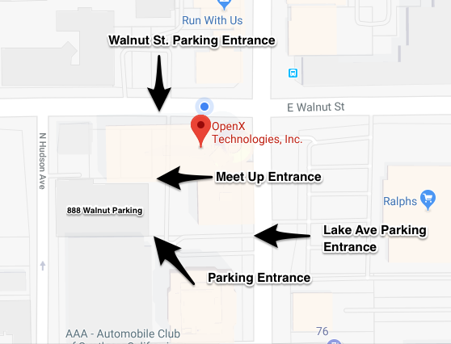

# HashiCorp & OpenX @ SoCal GitHub Users' Group

- _DATE:_ Oct 10, 2018

- _LOCATION:_ OpenX, 888 E Walnut St, 2nd Floor Pasadena CA, 91101 USA

- _SCHEDULE:_
  - 6pm - Doors Open
  - 6:30pm - Food & Drink
  - 6:45-8:15pm - Talks
  - 8:15-8:30 - Open Networking
  - 9pm - Doors Close

- _PARKING:_ The office is on the south-west corner of Walnut Ave and Lake Ave with parking entrances on both Walnut and Lake.  Once you enter from either driveway, you’ll find two parking garages.  Enter the 888 Walnut Garage (right entrance).  Make sure to get validation from the OpenX representative. 

___
- _SPEAKER:_ Caleb Sotelo, Software Architect, OpenX

- _TITLE:_ What does it take to show an ad?

- _SUMMARY:_ In 2017, advertisers in the US spent $80B to reach consumers with digital ads. What kind of technology is required to deliver ads to users, at global scale? This brief talk will cover the building blocks of ad-tech, and explore the technologies and systems that enable OpenX to handle billions of ad requests per day.

- _SPEAKER BIO:_ Caleb is a Software Architect at OpenX, where he works on simplifying core APIs and data models, and improving the management tools used to run the business. Previously he worked on JavaScript ad SDKs and delivery components in Erlang. He enjoys hiking the Sierra Nevadas.

----

- _SPEAKER:_ Jake Lundberg, Sr. Solutions Engineer, HashiCorp 

- _TITLE:_ The world according to HashiCorp: DevOps tools for today

- _SUMMARY:_ We'll take a look at how HashiCorp's open source products Vagrant, Packer, Terraform, Vault, Nomad and Consul help enable DevOps practices such as automating development environments, building pre-baked machine images, managing infrastructure with code, securing secrets, orchestrating containers as well as non-containerized applications, service discovery/registration, service configuration and service segmentation.

- _SPEAKER BIO:_ Jake is a Senior Solutions Engineer for HashiCorp with a past life as a Systems Administrator, Support Specialist and DevOps Engineer. You'll find him adventuring with his family, cycling, playing games, drinking beer and taking walks on the beach.

----
